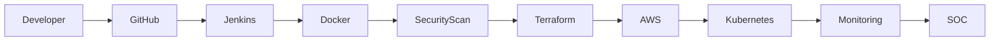
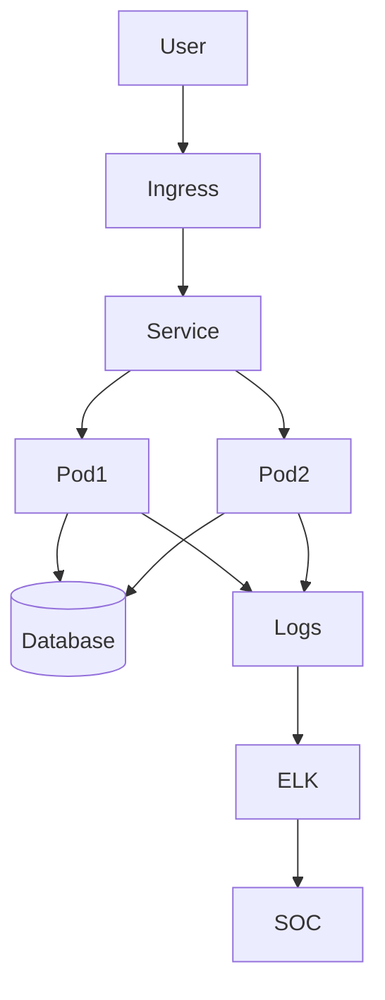

# Hi 👋 I'm Balaji R 

  

---

## 👨‍💻 Professional Summary

☁️ AWS Certified Solutions Architect – Associate  
⚙️ 1.5+ Years of Experience in Cloud Infrastructure & DevOps  
🔐 SOC Analyst – Incident Response & Threat Monitoring  
🌐 Strong Foundation in Networking, Linux & Security Operations  

Currently working as **Network Engineer** with hands-on exposure to AWS, Security Monitoring, CI/CD automation, and DDoS mitigation.

---

## 🔄 DevSecOps CI/CD Pipeline

---

## ☸ Kubernetes Architecture

---

## ☁️ Cloud Platforms

  

- EC2, RDS, S3, EBS  
- VPC (Public/Private Subnets, NAT, Security Groups)  
- IAM Roles & Policies  
- Auto Scaling & Load Balancers  
- Route 53  
- CloudWatch Monitoring  

---

## ⚙️ DevOps & Automation Stack

  

- CI/CD Pipelines using Jenkins  
- Infrastructure as Code (Terraform, Ansible)  
- Docker & Kubernetes Containerization  
- Linux Administration  
- Git Version Control  

---

## 🔐 SOC & Security Stack

  
  
  

- 24/7 Security Monitoring  
- SIEM Log Analysis  
- Alert Triage & Incident Escalation  
- DDoS Detection & Mitigation  
- Root Cause Analysis (RCA)  

---

## 📂 Key Projects

### 🔹 Scalable 3-Tier Architecture on AWS
- Designed EC2 + RDS + Load Balancer architecture  
- Configured Auto Scaling & Security Groups  
- Implemented monitoring with CloudWatch  

### 🔹 CI/CD Pipeline Automation
- Integrated GitHub with Jenkins  
- Provisioned infrastructure using Terraform  
- Automated S3 static website deployment  

---

## 📊 GitHub Stats

  

---

## 📫 Connect With Me

  
  
  

---

⭐ Cloud | DevOps | Kubernetes | Security | Automation
