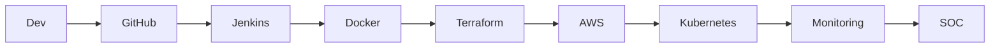

 

---

## 👨‍💻 Professional Summary

- ☁️ AWS Certified Solutions Architect – Associate  
- ⚙️ 1.5+ Years – Cloud Infrastructure & DevOps  
- 🔐 SOC Analyst – Threat Monitoring & Incident Response  
- 🌐 Strong Networking & Linux Background  

Focused on **Cloud Security, Kubernetes, DevSecOps & Automation Engineering**

---

## 🚀 Tech Stack

---

## 🔐 Security Stack

---

## 🔄 DevSecOps Flow

---

⭐ Cloud | DevOps | Kubernetes | Security | Automation
