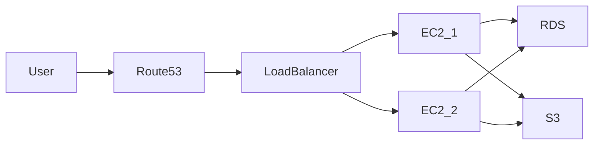

<h1>Hi 👋 I'm Balaji R</h1>

 

---

## ☁️ About Me

- AWS Certified Solutions Architect – Associate  
- 1.5+ Years Experience in Cloud Infrastructure  
- Strong Networking & Linux Background  
- Experience building scalable and secure cloud environments  

Focused on designing **highly available, resilient and scalable cloud architectures**

---

## ☁️ Cloud Platforms

- EC2, RDS, S3, EBS  
- VPC (Public/Private Subnets, NAT Gateway, Security Groups)  
- IAM Roles & Policies  
- Auto Scaling & Load Balancer  
- Route 53  
- CloudWatch Monitoring  

---

## ☸ Container & Platform Engineering

- Kubernetes Cluster Deployment  
- Containerized Application Deployment  
- Linux Server Administration  
- Pod Networking & Ingress  

---

## ⚙️ Automation & IaC

- Infrastructure as Code (Terraform)  
- Configuration Management (Ansible)  
- CI/CD Pipelines  
- Version Control  

---

## 🔄 Sample Cloud Architecture

---

⭐ Cloud | Infrastructure | Kubernetes | Automation | Networking
