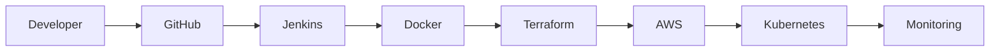

 

---

# 👨‍💻 Professional Summary

Cloud-focused engineer with hands-on experience in designing, deploying, and managing scalable infrastructure across AWS and Azure environments. Strong foundation in Linux systems, networking, automation, and container orchestration.

- ☁️ AWS Certified Solutions Architect – Associate  
- ⚙️ 1.5+ Years – Cloud Infrastructure & DevOps  
- 🔐 Experience in Security Monitoring & Infrastructure Hardening  
- 🌐 Strong Networking & Linux Administration  

> Focused on building resilient, secure, and automated cloud platforms.

---

# ☁️ Cloud & Platform Engineering

**Core Expertise**
- VPC Architecture (Public/Private Subnets, NAT, SG, NACL)
- EC2, RDS, S3, EBS
- Load Balancer & Auto Scaling
- IAM Policies & Role Design
- CloudWatch Monitoring
- Kubernetes Cluster Deployment & Pod Networking

---

# ⚙️ DevOps & Infrastructure Automation

- Infrastructure as Code using Terraform  
- Configuration Management with Ansible  
- CI/CD Pipelines (Build → Test → Deploy)  
- Containerization with Docker  
- Git-based version control workflows  

---

# 🔐 Security & Monitoring Stack

- Log Aggregation & SIEM Analysis  
- Infrastructure Threat Monitoring  
- DDoS Detection & Mitigation  
- Incident Triage & Root Cause Analysis  

---

# 🔄 Cloud Delivery Workflow

---

⭐ Cloud Architecture | DevOps Automation | Kubernetes | Secure Infrastructure
